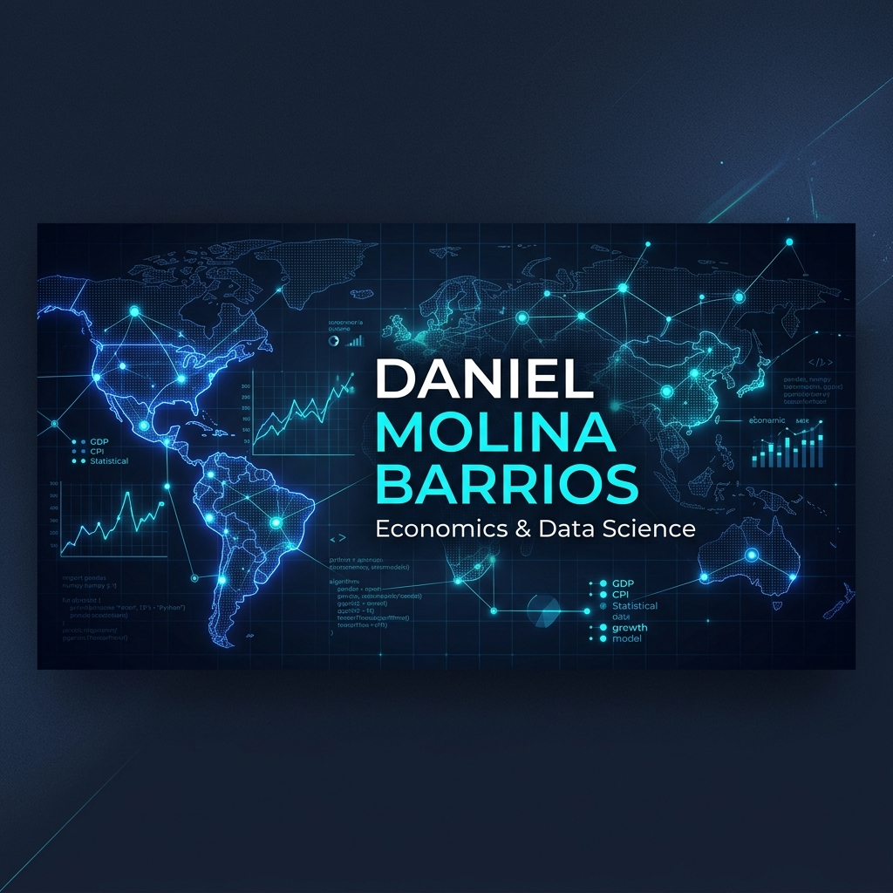

  

  

<h1 align="center">Daniel Molina Barrios</h1>

  <b>Datos que generan claridad. Sistemas que impulsan crecimiento.</b>

  Dashboards, automatizaciones, IA y páginas web que convierten información en decisiones estratégicas.

  <i>"Transformo datos en decisiones."</i>

  <a href="#-sobre-mí"><b>Sobre Mí</b></a> • 
  <a href="#-habilidades-técnicas"><b>Habilidades</b></a> • 
  <a href="#-proyectos-destacados"><b>Proyectos</b></a> • 
  <a href="#-estadísticas-analíticas"><b>Estadísticas</b></a> • 
  <a href="#-conectemos"><b>Contacto</b></a>

  

---

## 👤 Sobre Mí

¡Hola! 👋 Soy **Daniel Molina Barrios**, **Economista & Data Scientist** radicado en Santa Marta, Colombia 🇨🇴. 

Me especializo en diseñar **soluciones analíticas integrales** y flujos ETL robustos que convierten grandes volúmenes de datos en evidencia estratégica estructurada. Mi enfoque interdisciplinario me permite entender los problemas de negocio y económicos desde su raíz, y traducirlos en algoritmos predictivos, dashboards interactivos y automatizaciones eficientes que optimizan la toma de decisiones.

*   🎓 **Economista** con sólida formación en econometría, modelación multivariante y análisis cuantitativo.
*   💻 **Data Scientist** apasionado por la programación limpia, la ingeniería de datos de alto rendimiento y el machine learning aplicado.
*   📈 **Orientado a Resultados**: Creo sistemas que impulsan el crecimiento y automatizaciones que generan claridad operativa.

---

## 🛠️ Habilidades Técnicas

<table border="0" align="center" width="100%">
  <tr style="border: none;">
    <!-- Columna Datos -->
    <td align="left" width="33%" style="border: none; padding: 15px; vertical-align: top;">
      <h3 style="color: #7C3AED; margin-top: 0; font-family: 'Aeonik', sans-serif;">📊 Datos</h3>
      
Minería de datos, econometría, series temporales y procesamiento masivo.

      
    </td>
    <!-- Columna Dashboards -->
    <td align="left" width="33%" style="border: none; padding: 15px; vertical-align: top;">
      <h3 style="color: #2563EB; margin-top: 0; font-family: 'Aeonik', sans-serif;">📈 Dashboards</h3>
      
Visualización ejecutiva, reportes interactivos, Quarto y front-end.

      

        
        
      

    </td>
    <!-- Columna IA & Automatización -->
    <td align="left" width="34%" style="border: none; padding: 15px; vertical-align: top;">
      <h3 style="color: #06B6D4; margin-top: 0; font-family: 'Aeonik', sans-serif;">🧠 IA & Automatización</h3>
      
Modelado predictivo, pipelines ETL optimizados y control de calidad de código.

      
    </td>
  </tr>
</table>

---

## 🚀 Proyectos Destacados

### 📊 1. [EMICRON 2024](https://github.com/dmetrics1/micronegocios-colombia-2024)
*Minería de patrones y análisis ponderado de **5.3 millones de micronegocios** en Colombia (DANE).*

  
  
  
  

*   **Pipeline Estadístico**: Integración de microdatos oficiales de 77K registros y minería de reglas de asociación (**Apriori**) en R para estudiar la adopción TIC.
*   **Reportería Premium**: Diseño de reporte interactivo adaptativo en **Quarto HTML** (CSS Grid/SCSS) que visualiza **85 cuadros oficiales** validados con precisión matemática.

---

### 📈 2. [Dashboard de Mercado Laboral](https://github.com/dmetrics1/dashboard_mercado_laboral_colombiano)
*Plataforma interactiva para la exploración y análisis territorial de la GEIH (DANE) · 2022–2025.*

  
  
  
  

*   **Ingeniería de Datos**: Pipeline ETL optimizado con **Polars** que consolida 24 dimensiones analíticas territoriales y salariales ponderadas (`FEX_C18`).
*   **Garantía de Calidad**: **25 pruebas unitarias automatizadas con pytest** que verifican la precisión matemática de las métricas salariales e índices económicos.

---

### 📉 3. [PCA Pobreza Multidimensional](https://github.com/dmetrics1/colombia-multidimensional-poverty-pca)
*Modelación econométrica de reducción dimensional para perfilar vulnerabilidad y exclusión.*

  
  
  

*   **Análisis Multivariante**: Aplicación de **Componentes Principales (PCA)** para la construcción de índices sintéticos de pobreza departamental en Colombia, reduciendo la dimensionalidad de las carencias del hogar.

---

## 📈 Estadísticas Analíticas

<table border="0" align="center" width="100%">
  <tr style="border: none;">
    <td align="center" width="50%" style="border: none; padding: 10px; vertical-align: middle;">
      
    </td>
    <td align="center" width="50%" style="border: none; padding: 10px; vertical-align: middle;">
      
    </td>
  </tr>
</table>

---

## 📬 Conectemos

  ¿Tienes un proyecto de análisis, automatización o dashboard que quieras llevar al siguiente nivel?

   &nbsp;&nbsp;
   &nbsp;&nbsp;
  

 

  Diseñado con la identidad de marca oficial de Daniel Molina Barrios © 2026.

